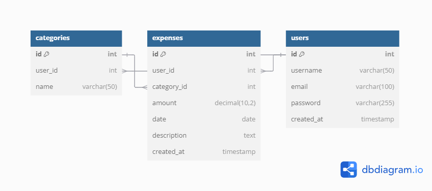

# Expense Tracker Database

This repository contains the SQL schema and data for the Expense Tracker application. The database is designed to manage user expenses, categories, and related information. Below, you will find the Entity-Relationship Diagram (ERD), a description of the database structure, roles, and other relevant information.

## Entity-Relationship Diagram (ERD)

## Database Structure

### Tables

1. **categories**
   - **id**: Primary key, auto-incremented integer.
   - **user_id**: Foreign key referencing `users.id`.
   - **name**: Name of the category (e.g., Food, Transport).

2. **expenses**
   - **id**: Primary key, auto-incremented integer.
   - **user_id**: Foreign key referencing `users.id`.
   - **category_id**: Foreign key referencing `categories.id`.
   - **amount**: Decimal value representing the expense amount.
   - **date**: Date of the expense.
   - **description**: Text description of the expense.
   - **created_at**: Timestamp of when the expense was created.

3. **users**
   - **id**: Primary key, auto-incremented integer.
   - **username**: Username of the user.
   - **email**: Email address of the user (unique).
   - **password**: Hashed password of the user.
   - **created_at**: Timestamp of when the user was created.

### Relationships

- Each category is associated with a user (`categories.user_id` references `users.id`).
- Each expense is associated with a user (`expenses.user_id` references `users.id`).
- Each expense is associated with a category (`expenses.category_id` references `categories.id`).

## Database Role in the Project

The database plays a crucial role in the Expense Tracker project by:

1. **Storing User Information:**
   - The `users` table stores user credentials and profile information, enabling user authentication and management.

2. **Managing Expense Categories:**
   - The `categories` table allows users to create and manage different expense categories, providing a structured way to categorize expenses.

3. **Tracking Expenses:**
   - The `expenses` table records all user expenses, including the amount, date, category, and description. This enables users to track their spending habits and generate reports.

4. **Ensuring Data Integrity:**
   - The database schema includes foreign key constraints to maintain data integrity and ensure that expenses and categories are correctly associated with users.

5. **Supporting Application Features:**
   - The database supports various application features such as expense tracking, category management, user authentication, and reporting.

## SQL Dump

The SQL dump file [`expensetracker-db_sql.sql`](./expensetracker-db_sql.sql) contains the schema and initial data for the Expense Tracker database. It includes the following:

- Table creation statements for `categories`, `expenses`, and `users`.
- Insert statements for initial data in each table.
- Indexes and constraints for data integrity.

### How to Import the Database

1. **Using phpMyAdmin:**
   - Log in to phpMyAdmin.
   - Select or create a database.
   - Go to the "Import" tab.
   - Choose the `expensetracker-db_sql.sql` file.
   - Click "Go" to import the database.

2. **Using MySQL Command Line:**
   - Open your terminal or command prompt.
   - Log in to MySQL: `mysql -u username -p`
   - Create a new database: `CREATE DATABASE expensetracker;`
   - Use the new database: `USE expensetracker;`
   - Import the SQL file: `SOURCE /path/to/expensetracker-db_sql.sql;`

## Additional Information

- The database uses InnoDB as the storage engine for all tables.
- The character set is `utf8mb4` and the collation is `utf8mb4_0900_ai_ci`.
- The database is designed to support multiple users, each with their own categories and expenses.

For any questions or issues, please contact the development team .

---