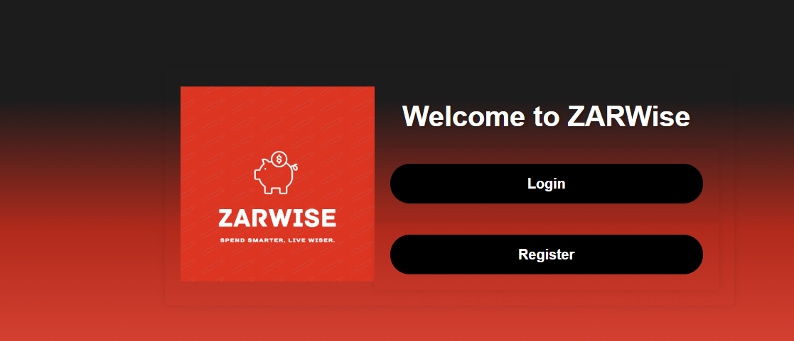
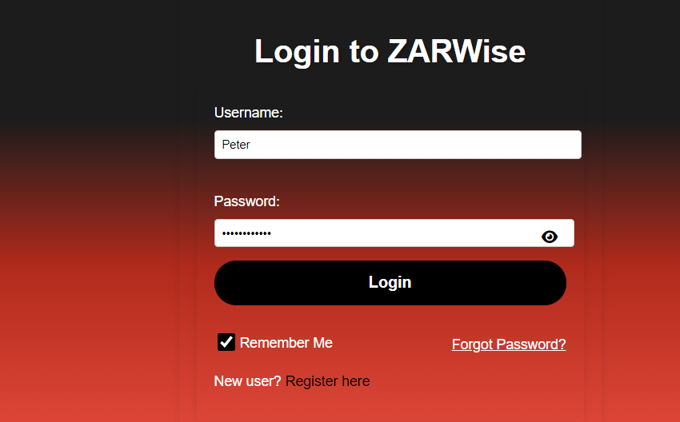
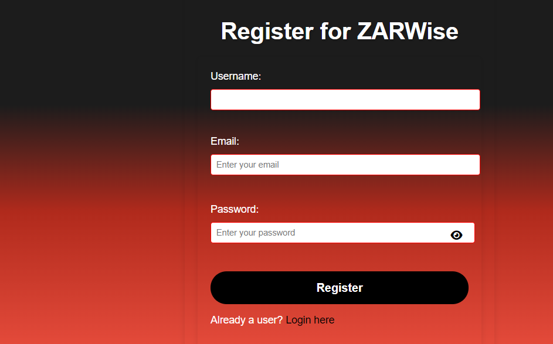
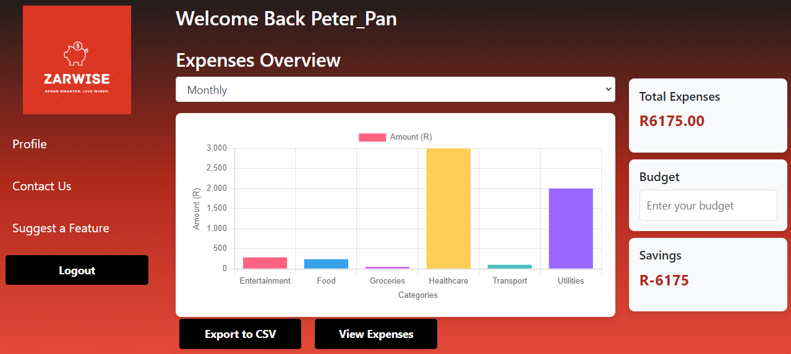
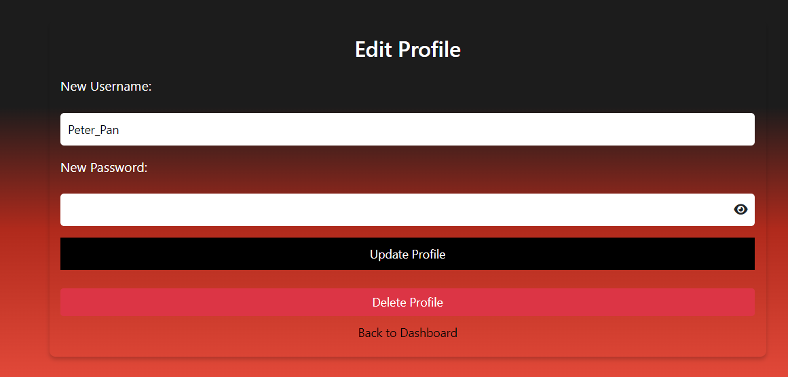
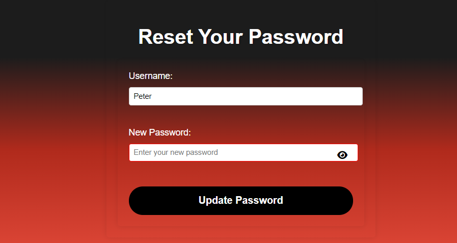
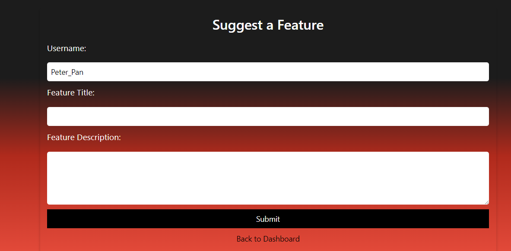
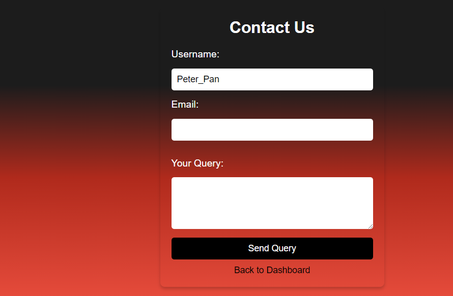

# Frontend Overview
The Personal Expense Tracker frontend is a web application designed to help users manage their personal finances by tracking expenses, setting budgets, and viewing financial summaries. The frontend is built using HTML, CSS, and JavaScript, and it interacts with a backend server to store and retrieve data.

## File Descriptions

### HTML/PHP Files

- **index.php**
  - The landing page of the application. It provides options for users to log in or register.
   

- **login.php**
  - The login page where users can enter their credentials to access their accounts. It includes form validation a "Remember Me" feature and a "Forgot Password" feature.
  

- **register.php**
  - The registration page where new users can create an account. It includes form validation for username, email, and password.
    

- **dashboard.php**
  - The main dashboard page where users can view their expenses, set budgets, and see financial summaries. It includes charts and tables for data visualization.
  

- **profile.php**
  - The profile page where users can update their username and password. It also includes an option to delete the account.
  

- **forgot_password.php**
  - The page where users can reset their password if they have forgotten it. It includes form validation for the new password.
  

- **suggestfeature.php**
  - The page where users can suggest new features for the application. It includes a form to submit suggestions via email.
  

- **contactform.php**
  - The contact form page where users can send queries or feedback. It includes form validation for the email field.
  

- **logout.php**
  - The script that handles user logout by destroying the session and redirecting to the login page.

### CSS Files

- **style.css**
  - The main stylesheet for the application. It includes general styling for the body, forms, buttons, and links.

- **dashboard.css**
  - The stylesheet specifically for the dashboard page. It includes styling for the sidebar, charts, tables, and various sections of the dashboard.

- **profile.css**
  - The stylesheet for the profile page. It includes styling for the form and buttons used to update the profile.

- **suggestfeature.css**
  - The stylesheet for the suggest feature page. It includes styling for the form and buttons used to submit feature suggestions.

- **contactform.css**
  - The stylesheet for the contact form page. It includes styling for the form and buttons used to send queries.

### JavaScript Files

- **script.js**
  - The main JavaScript file for the application. It includes functions for form validation, password visibility toggle, and handling "Remember Me" functionality.

- **chart.js**
  - The JavaScript file for handling the expense chart on the dashboard. It includes functions to fetch and update chart data, and to show expense details in a modal.

- **ajax.js**
  - The JavaScript file for handling AJAX requests. It includes functions to load expenses, handle form submissions, and show feedback messages using toasts.

## Contributing

For any questions or issues, please contact the development team at [marceldelange20@gmail.com](mailto:marceldelange20@gmail.com)